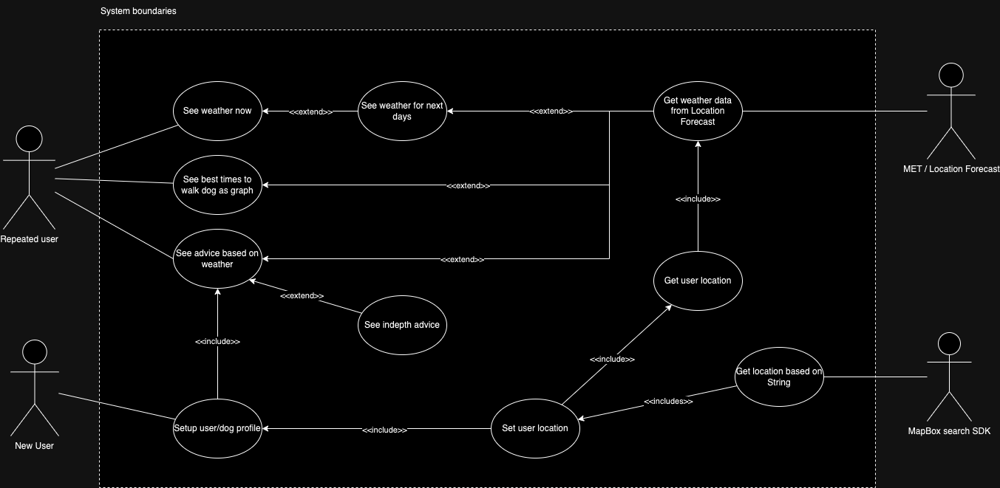

# Modellering


## Use Case Diagram


Viser de viktigste funskjonene i appen og hvilke avhengigheter de har. 

## Activity Diagram
```mermaid
flowchart TD;

    Start((Start))

    AapneApp([Launch app])
    VisVelkomsskjerm([Show welcome screen])
    SkrivNavn([Write names])
    VelgAlder([Choose age category])
    VelgSnute([Choose nose vategory])
    VelgKropp([Choose body category])
    VelgPels([Choose fur categories])
    GiLokasjon([Write location])
    GiLokasjonUtenKonfigurasjon([Write Location])
    VisHjemskjerm([Show home screen])


    foerstegangsbruker{First time user?}
    hoppover{Skip configuration?}
    gaatilbakenavn{Go back?}
    gaatilbakelokasjon{Go back?}
    gaatilbakealder{Go back?}
    gaatilbakesnute{Go back?}
    gaatilbakekropp{Go back?}

    Start --> AapneApp
    AapneApp --> foerstegangsbruker
    foerstegangsbruker --JA--> VisVelkomsskjerm
    foerstegangsbruker --NEI--> VisHjemskjerm
    VisVelkomsskjerm --> hoppover
    hoppover --JA--> GiLokasjonUtenKonfigurasjon
    GiLokasjonUtenKonfigurasjon --> VisHjemskjerm
    hoppover --NEI--> SkrivNavn 

    SkrivNavn --> GiLokasjon
    GiLokasjon --> gaatilbakenavn
    gaatilbakenavn --JA--> SkrivNavn
    gaatilbakenavn --> VelgAlder

    VelgAlder --> gaatilbakelokasjon
    gaatilbakelokasjon --JA--> GiLokasjon
    gaatilbakelokasjon --> VelgSnute

    VelgSnute --> gaatilbakealder
    gaatilbakealder --JA--> VelgAlder
    gaatilbakealder --> VelgKropp

    VelgKropp --> gaatilbakesnute
    gaatilbakesnute --JA--> VelgSnute
    gaatilbakesnute --> VelgPels

    VelgPels --> gaatilbakekropp
    gaatilbakekropp --JA--> VelgKropp
    gaatilbakekropp --> VisHjemskjerm

    VisHjemskjerm --> Slutt

    Slutt((End))
````

Navn: \
Aktør: Bruker\
Prebetingelse: Bruker har lastet ned appen og er klar for bruk\
Postbetingelse: Bruker får...