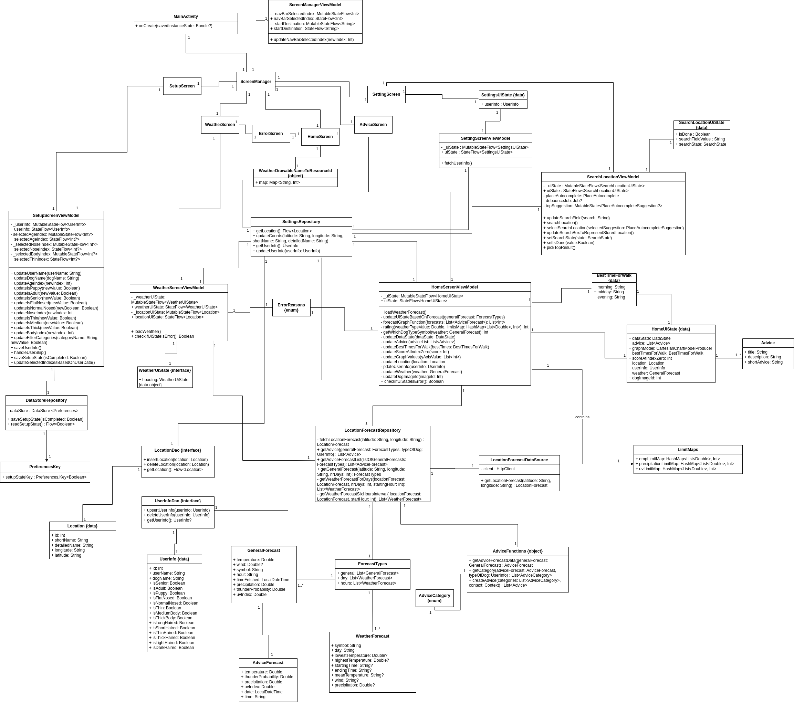

# Modellering


## Use Case Diagram


Viser de viktigste funskjonene i appen og hvilke avhengigheter de har. 


## Activity Diagram
```mermaid
flowchart TD;

    Start((Start))

    AapneApp([Launch app])
    VisVelkomsskjerm([Show welcome screen])
    SkrivNavn([Write names])
    VelgAlder([Choose age category])
    VelgSnute([Choose nose vategory])
    VelgKropp([Choose body category])
    VelgPels([Choose fur categories])
    GiLokasjon([Write location])
    GiLokasjonUtenKonfigurasjon([Write Location])
    VisHjemskjerm([Show home screen])


    foerstegangsbruker{First time user?}
    hoppover{Skip configuration?}
    gaatilbakenavn{Go back?}
    gaatilbakelokasjon{Go back?}
    gaatilbakealder{Go back?}
    gaatilbakesnute{Go back?}
    gaatilbakekropp{Go back?}

    Start --> AapneApp
    AapneApp --> foerstegangsbruker
    foerstegangsbruker --JA--> VisVelkomsskjerm
    foerstegangsbruker --NEI--> VisHjemskjerm
    VisVelkomsskjerm --> hoppover
    hoppover --JA--> GiLokasjonUtenKonfigurasjon
    GiLokasjonUtenKonfigurasjon --> VisHjemskjerm
    hoppover --NEI--> SkrivNavn 

    SkrivNavn --> GiLokasjon
    GiLokasjon --> gaatilbakenavn
    gaatilbakenavn --JA--> SkrivNavn
    gaatilbakenavn --> VelgAlder

    VelgAlder --> gaatilbakelokasjon
    gaatilbakelokasjon --JA--> GiLokasjon
    gaatilbakelokasjon --> VelgSnute

    VelgSnute --> gaatilbakealder
    gaatilbakealder --JA--> VelgAlder
    gaatilbakealder --> VelgKropp

    VelgKropp --> gaatilbakesnute
    gaatilbakesnute --JA--> VelgSnute
    gaatilbakesnute --> VelgPels

    VelgPels --> gaatilbakekropp
    gaatilbakekropp --JA--> VelgKropp
    gaatilbakekropp --> VisHjemskjerm

    VisHjemskjerm --> Slutt

    Slutt((End))
````


## Sequence diagram

**Written explanation**

- Navn: See advice based on on weather
- Prebetingelser: Bruker har fullført setup-prosess
- Postbetingelser: Bruker kan se anbefalinger basert på sin hund
 
Hovedflyt:

1.     Bruker åpner appen
2.     Systemet henter lokasjon fra database
3.     Systemet henter værdata basert på lokasjon
4.     Systemet prosesserer værdata om til anbefalinger basert på hunden til bruker
5.     Det vises frem anbefalinger-kort på hjemskjermen. 

 
Alternativ flyt:

3.1 Værdata er utilgjengelig, for eksempel API er nede eller bruker har ikke internett

3.2 Systemet fanger opp feil og lagrer feilkoden.

3.3 Det vises frem en feil-skjerm basert på feil koden


```mermaid


sequenceDiagram
    actor User
    participant PawCast 
    participant SettingsRepository
    participant LocationDao
    participant LocationForecastRepository
    participant LocationDataSource API
    participant UserInfoDao

    User ->>+ PawCast: Opens app
    PawCast ->>+ SettingsRepository: getLocation()
    SettingsRepository ->>+ LocationDao: getLocation()
    LocationDao -->>+ SettingsRepository: Location
    SettingsRepository -->>+ PawCast: Location
    PawCast -->> PawCast: updateLocation()
    PawCast ->> PawCast: loadWeatherForecast()
    PawCast ->>+ LocationForecastRepository: getGeneralForecast()
    LocationForecastRepository ->> LocationForecastRepository: fetchLocationForeCast()
    LocationForecastRepository ->>+ LocationDataSource API: getLocationForecast()

    alt No internet
    LocationDataSource API ->> PawCast: catches exception
    PawCast -->> PawCast: Updates datastate to show internet error
    PawCast -->>+ User: Shows Error screen

    else Has internet
    LocationDataSource API -->>+ LocationForecastRepository: LocationForecast 
    LocationForecastRepository -->>+ PawCast: LocationForecast
    PawCast ->> PawCast: updateUiStateBasedOnForecast() with LocationForecast
    PawCast ->> PawCast: updateUserInfo()
    PawCast ->>+ SettingsRepository: getUserInfo() 
    SettingsRepository ->>+ UserInfoDao: getUserInfo()
    UserInfoDao -->> SettingsRepository: UserInfo
    SettingsRepository -->> PawCast: UserInfo
    PawCast ->>+ PawCast: updateAdvice()
    PawCast ->>+ LocationForecastRepository: getAdvice() with LocationForecast and UserInfo
    LocationForecastRepository -->> PawCast: List of Advice
    PawCast -->>+ User: Shows textboxes with advice in homescreen
    end

````


**Written explanation**

- Navn: Change location from settings menu
- Prebetingelser: Bruker har satt opp lokasjon fra før og dermed fullført en setupprosess. Har navigert til innstillinger skjermen 
- Postbetingelser: Systemer har lagret en ny lokasjon 
 
Hovedflyt:
1.     Bruker trykker på søke-tekstboksen i innstillinger skjermen
2.     Systemet åpner en resultat boks mens den venter på input. 
3.     Brukeren begynner å skrive eller redigerer tekst strengen
4.     Systemet kaller på Mapbox search SDKen med tekststrengen
5. 	   Mapbox returnerer en liste av forslag og disse vises som forslag i resultat boksen
6. 	   Brukeren trykker på et av forslagene
7.     Systemet sender valgt forslag til Mapbox 
8.     Et resultat med koordinater returneres
9.     Koordinater og navn blir skrevet til databasen 

 
Alternativ flyt:

4.1 Mapbox er utilgjengelig, for eksempel API er nede eller bruker har ikke internett

4.2 Systemet fanger opp feil.

4.3 Det vises frem en feil i resultatlisten istedenfor forslag.

```mermaid

sequenceDiagram
  actor User as User
  participant PawCast as PawCast
  participant MapBox API as MapBox API
  participant SettingsRepository
  participant LocationDao

  User ->>+ PawCast: Types in location
  PawCast ->>+ MapBox API: SearchLocation()

  alt No internet

  MapBox API ->>+ PawCast: catches exception
  PawCast ->>+ PawCast: setSearchState(Searchstate.Error)
  PawCast -->>+ User: Shows Errorscreen 


  else Internet

  MapBox API -->>+ PawCast: List of suggested locations
  PawCast -->>+ User: List of suggested locations
  User ->>+ PawCast: selectLocation()
  PawCast ->>+ MapBox API: selectSearchLocation(SelectedLocation)
  MapBox API -->>+ PawCast: Selected location
  PawCast -)+ SettingsRepository: updateCoords() with Selected location values
  SettingsRepository ->>+ LocationDao: insertLocation()
  LocationDao -->> LocationDao: Updates Location
  PawCast -->> PawCast: updateSearchBoxToRepresentStoredLocation()
  PawCast ->>+ SettingsRepository: getLocation()
  SettingsRepository ->>+ LocationDao: getLocation()
  LocationDao -->>+ SettingsRepository: Location
  SettingsRepository -->>+ PawCast: Location
  PawCast -->> PawCast: Updates value of searchfield to location
  end

````


## Class Diagram


