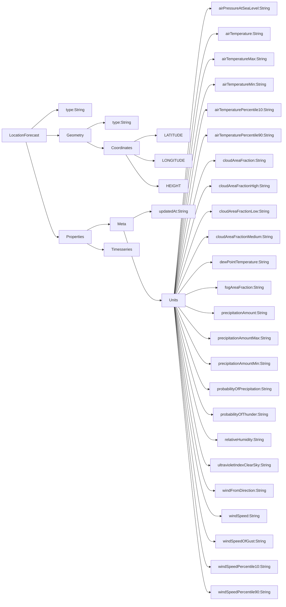

```mermaid

graph LR
    LocationForecast-->type1[type:String];
    LocationForecast-->Geometry;
    LocationForecast-->Properties;

    
    Geometry-->type2[type:String];
    Geometry-->Coordinates;

    Coordinates-->LATITUDE
    Coordinates-->LONGITUDE
    Coordinates-->HEIGHT

    Properties-->Meta
    Properties-->Timesseries

    Meta-->updatedAt:String
    Meta-->Units

    Units-->airPressureAtSeaLevel:String    
    Units-->airTemperature:String           
    Units-->airTemperatureMax:String        
    Units-->airTemperatureMin:String      
    Units-->airTemperaturePercentile10:String  
    Units-->airTemperaturePercentile90:String  
    Units-->cloudAreaFraction:String     
    Units-->cloudAreaFractionHigh:String   
    Units-->cloudAreaFractionLow:String   
    Units-->cloudAreaFractionMedium:String  
    Units-->dewPointTemperature:String  
    Units-->fogAreaFraction:String  
    Units-->precipitationAmount:String  
    Units-->precipitationAmountMax:String  
    Units-->precipitationAmountMin:String  
    Units-->probabilityOfPrecipitation:String  
    Units-->probabilityOfThunder:String  
    Units-->relativeHumidity:String  
    Units-->ultravioletIndexClearSky:String  
    Units-->windFromDirection:String  
    Units-->windSpeed:String  
    Units-->windSpeedOfGust:String  
    Units-->windSpeedPercentile10:String  
    Units-->windSpeedPercentile90:String  
     

```